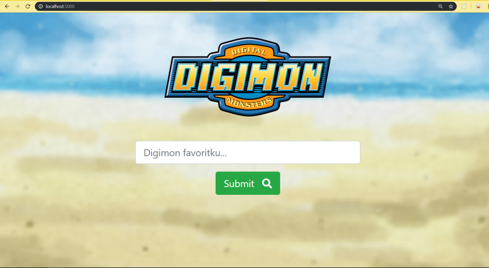
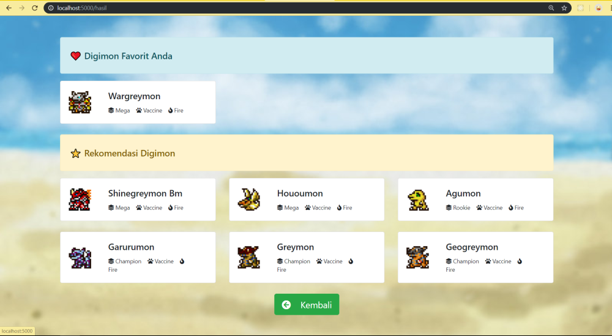
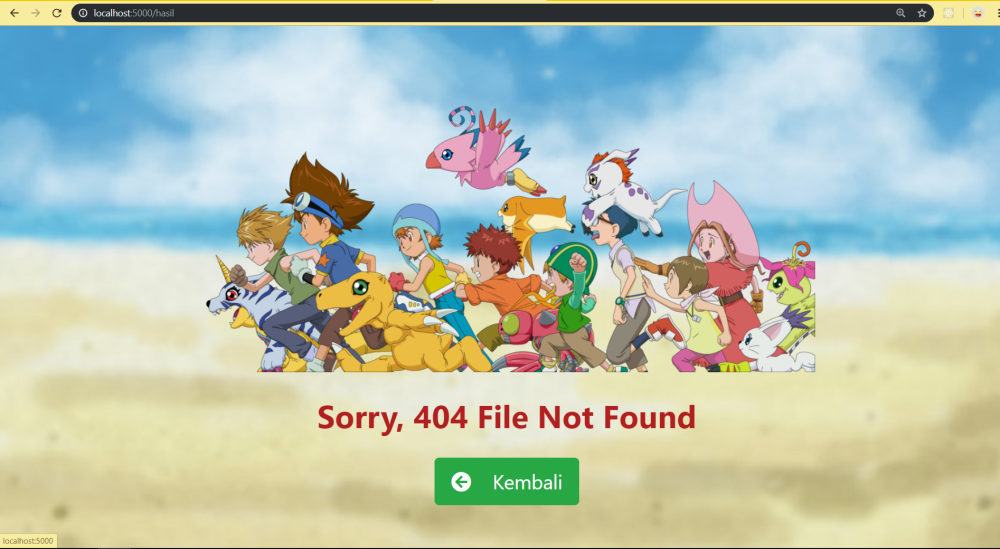

## **Soal 3 - Digimon Recommendation**

Dengan memanfaatkan file output __digimon.json__ dari _Soal 2_, buatlah sebuah __*content-based filtering recommender system*__ dengan menggunakan __aplikasi Flask__, yang dapat memfasilitasi user untuk menyebutkan Digimon favoritnya & menyajikan rekomendasi __6 Digimon__ berdasarkan feature: __stage__, __type__ & __attribute__ Digimon. Aplikasi yang dibuat harus memenuhi syarat minimal berikut:

1. Server aplikasi akan berjalan di __localhost:5000__ dan ketika user melakukan GET request via browser akan tampil sebuah halaman __HTML__ sederhana yang memuat __1 buah text input__ dan __1 buah button__. Desain tampilan HTML tidak harus sama seperti contoh soal, utamakan fitur!

    

2. User dapat memasukkan nama Digimon favoritnya ke dalam text input yang sudah disediakan. Saat user menekan tombol __"Submit"__, aplikasi akan mengambil data Digimon favorit user di file __digimon.json__. Jika data ditemukan, maka user akan di-redirect ke __localhost:5000/hasil__ yang berisi halaman __HTML__, yang menampilkan data seputar Digimon favorit user, disertai dengan data __6 Digimon__ yang direkomendasikan berdasarkan __stage__, __type__ & __attribute__-nya. Data yang ditampilkan untuk tiap Digimon minimal hanya: _nama_, _gambar_, _stage_, _type_ & _attribute Digimon_. Halaman ini juga dilengkapi __1 buah button__ untuk kembali ke halaman awal. Desain tampilan HTML tidak harus sama seperti contoh soal, utamakan fitur!

    - Contoh jika user memfavoritkan __Agumon__ :
    
        

        

    - Contoh jika user memfavoritkan __Wargreymon__ :

        

        

4. Namun jika Digimon favorit user tidak ditemukan atau tidak ada di dalam file __digimon.json__, maka user akan di-redirect ke halaman __HTML__ yang memberikan informasi bahwa data tidak ditemukan. Halaman ini juga dilengkapi __1 buah button__ untuk kembali ke halaman awal. Desain tampilan HTML tidak harus sama seperti contoh soal, utamakan fitur!

    

✅ _Commit & push source code jawaban soal ini ke __Github__ Anda, buatlah repo dengan nama __Ujian_Digimon_Recommendation__, kemudian lampirkan __url link repo Github__ Anda via email ke lintang@purwadhika.com!_
